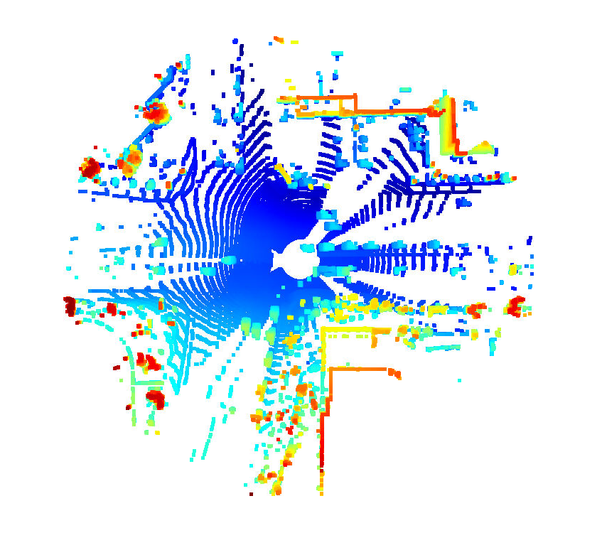

## MidTerm project 3D Object Detection

This project uses the data from the `sequence 3` TF record and `top` lidar and `front` camera.

`Step 1 - Compute Lidar Point Cloud from Range Image: `

Based on the [rubrics](https://review.udacity.com/#!/rubrics/3008/view) criteria that are need to be done are,

`Visualize range Image channels (ID_S1_EX1)`
- Convert range image “range” channel to 8bit
- Convert range image “intensity” channel to 8bit
- Crop range image to +/- 90 deg. left and right of the forward-facing x-axis
- Stack cropped range and intensity image vertically and visualize the result using OpenCV

`Stacked cropped range and intensity Image` 


### How it is obtained

- Compressed Laser data is obtained from `waymo dataset` from the frame. They are decompressed using `zlib` python library. 
- Range data is obtained from channel0 of the decompressed matrix.
- Intensity data is obtained from channel1 of the matrix
- As the ri contains the complete 360&deg; we can divide the channel by 4 to get the 90&deg;

`Visualize point-cloud (ID_S1_EX2)`

- Visualize the point-cloud using the open3d module.
- Find 10 examples of vehicles with varying degrees of visibility in the point-cloud.
- Try to identify vehicle features that appear stable in most of the inspected examples and describe them.




<br>

<br>

`Video of the point-cloud`

`Image Analysis` - From analysing the images from point cloud, we can see the edges of the vehicles are clearly visible. Though exterior designs are not visible, dimensions of the vehicles are clearly visible. Intensity channel gives more detailed image than the range channel. 

`Step 2 - Create Birds-Eye View from Lidar PCL`

- Convert coordinates in x,y [m] into x,y [pixel] based on width and height of the bev map
- Assign lidar intensity values to the cells of the bird-eye view map
- Adjust the intensity in such a way that objects of interest (e.g. vehicles) are clearly visible
- Make use of the sorted and pruned point-cloud `lidar_pcl_top` from the previous task
- Normalize the height in each BEV map pixel by the difference between max. and min. height
- Fill the "height" channel of the BEV map with data from the point-cloud


`BEV Image 1`


`Normalized height and intensity Image Sample 1`

<p float="left">
    
    
</p>

`BEV Image 2`


`Normalized height and intensity Image Sample 2`

<p float="left">
    
    
</p>

`Step 3 - Model-based Object Detection in BEV Image`

- In addition to Complex YOLO, extract the code for output decoding and post-processing from the GitHub repo.
- Transform BEV coordinates in [pixels] into vehicle coordinates in [m]
- Convert model output to expected bounding box format [class-id, x, y, z, h, w, l, yaw]


```
These are two different frames and object detected stacked up in BEV image and camera image. 
```

`Performance Evaluation for Object Detection`

- For all pairings of ground-truth labels and detected objects, compute the degree of geometrical overlap
- The function tools.compute_box_corners returns the four corners of a bounding box which can be used with the Polygon structure of the Shapely toolbox
- Assign each detected object to a label only if the IOU exceeds a given threshold
- In case of multiple matches, keep the object/label pair with max. IOU
- Count all object/label-pairs and store them as “true positives”
- Compute the number of false-negatives and false-positives based on the results from IOU and the number of ground-truth labels
- Compute “precision” over all evaluated frames using true-positives and false-positives
- Compute “recall” over all evaluated frames using true-positives and false-negatives


The performance is calculated based on the 10 frames from the sequence.
```
precision = 0.96
recall = 0.741
```
